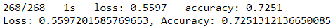
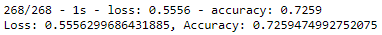
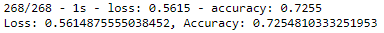
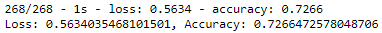
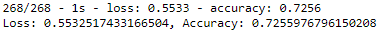

# Neural Network Charity Analysis

The purpose of this analysis was to use machine learning and neural networks to create a binary classifier that is capable of predicting whether applicants will be successful if funded by Alphabet Soup.  The three steps of the analysis were 

1. Preprocessing the data
2. Compiling, Training and Evaluating the Model
3. Optimizing the Model

## Resources
Data: charity_data.csv  
Software: Python 3.7, Pandas 1.1.3, Scikit-learn 0.23.2, TensorFlow 2.4.1, Jupyter 1.0.0 

## Results

### Preprocessing the Data

The first step of the analysis was to preprocess the data.  First, the 'EIN' and 'NAME' columns were dropped from the data because it is safe to assume that they would not have an effect on the success of applicants.  

Next, all object type columns were reviewed to determine if the number of unique values should be reduced by binning less common values into an "other" group. This was completed for both the Application Type and Classification columns.  

Then, because the model is unable to handle object type data, each of the object type columns was encoded using OneHotEncoder and the original object type columns were dropped.

After converting all of the data to the proper format, the target variable (y) for the analysis was set as the 'IS_SUCCESSFUL' column and the features variable (X) was set as all of the columns associated with 'APPLICATION TYPE', 'AFFILIATION', 'CLASSIFICATION', 'USE_CASE', 'ORGANIZATION', 'STATUS', 'INCOME_AMT', 'SPECIAL_CONSIDERATIONS' and 'ASK_AMT'.  The data was then split into training and testing datasets and the features datasets (X_train & X_test) were scaled using StandardScaler() to normalize the data in hopes to create a more accurate model.

### Compiling, Training, and Evaluating the Model

For the first pass at running the model, the number of activation functions was set equal to the number of columns in the features variable (X), which was 43.  Two layers were used initially to see if a basic nueral network would be a good fit for the data.  The first layer was set to use 80 neurons, which is about double the input features, and the second layer was set to use 30 neurons.  The two layers were assigned the "relu" activation and the output later was assigned the "sigmoid" activation.  This original model acheived an accuracy of 72.40%, which was below the target model performance of 75%.

### Optimization

Because the model did not reach the target performance of 75%, a few adjustments were made to the model to try and improve the performance accuracy.  Below are descriptions of the five adjustments that were made and the performance of the model after each adjustment.

  1. **Adjust the input data** -  
  It's not usually a good idea to delete data if avoidable but in this case, I wanted to see if dropping the data in the 'ASK_AMT' column would have any effect on the model performance.  It was possible that it may have had some outliers that were skewing the model and inhibiting accuracy.  After running the model, however, there seemed to be only miniscule improvements in accuracy (72.59%) so the data was reinserted into the analysis for the remaining 4 optimization attempts. 
      

  2. **Adding more neurons** -  
  As a general rule, the first layer should have 2-3 times the number of neurons as input features in the data.  Since 80 neurons in our original model was twice the number of imput features, I decided to increase the neurons in the first layer to 3 times the imput features for optimization.  This set the first layer to have 129 layers, and I then increased the second layer to have 50 neurons.  This model also only provided miniscule improvements to in accuracy at 72.45%. 
  
  
  3. **Adding more layers** -  
  The initial model only had two layers.  This optimization attempt added a third layer with an additional 20 neurons but still only saw minor improvements to the model accuracy at 72.59%. 
  
  
  4. **Changing the activation** -  
  The original model used "relu" as the activation for it's two layers.  I tried using "tanh" as the activation for each layer and then also tried "sigmoid" as the activation for each layer.  "Sigmoid" provided the better results but still only resulted in a model accuracy of 72.64%. 
  
  
  5. **Increasing number of epochs** -  
  The final attempt at increasing the accuracy of the model was to increase the number of epochs.  For this model, I continued with the 3 layer model with the added neurons and "sigmoid" activation and then increased the epochs to 500.  The accuracy actually dropped just slightly from running the same model with only 100 epochs and only had an accuracy of 72.59%.
  
  
Ultimately, even with 5 attempts at optimization, I was unable to get the neural network model to perform at the 75% target accuracy.

### Summary
Summarize the overall results of the deep learning model. Include a recommendation for how a different model could solve this classification problem, and explain your recommendation.
